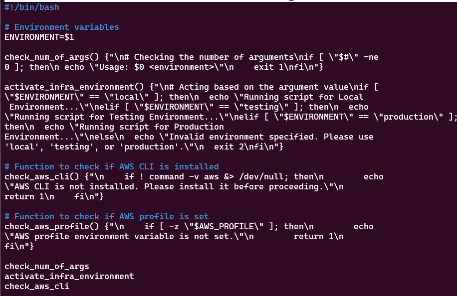

# function-and-array-in-shell-scripting

This mini-project on "Working with Functions and array" in shell scripting emphasized the critical role of functions in organizing and streamlining code for clarity, efficiency, and reusability, particularly within the context of automating AWS setup for clients. Key learning involved encapsulating specific logic, such as checking for script arguments, verifying AWS CLI installation using command -v aws (and redirecting output to /dev/null for silent checks), and confirming the existence of AWS authentication environment variables or configuration files (like ~/.aws/credentials and ~/.aws/config). The project highlighted the importance of defining functions, understanding their syntax, and strategically calling them within the script's flow to ensure logical execution and maintainability, ultimately advocating for a modular approach where individual requirements are satisfied by dedicated functions.

